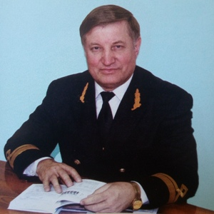

## Golikov Vladimir A.

__National University “Odessa Maritime Academy” (Odessa, Ukraine)__

__Department of Fleet Technical Operation__

Head of Department of Fleet Technical Operation, Vice-rector on Scientific Work, Doctor of Science (the highest research degree), Professor, Honored Worker of Education in Ukraine, Honorary Worker of Maritime and River Transport in Ukraine

[seu@gmail.com](mailto:seu@gmail.com)

Professional (academic) interests: marine engineering; maritime transport; ship power plants automation and environmental support system

Selected Publications:

1. Golikov V. A., Burdenko, A. F., Tsyupko Y. M. Mathematical simulation of processes human body with environment heat exchange // Ship Power Plants: Sc.-Tech. Col – 2003. №. 8. – P. 104-115.

2. Golikov V.A., Golubev M.V. System Approach to Solving the Problem of Increasing the Effectiveness of Marine Power Plants Maintenance // Ship Power Plants: Sc.-Tech. Col. – 2004. – No 10. – Odessa: ONMA. – P. 50-53

3. Golikov V.A., Tsyupko Y.M. Research of dynamic characteristics of a complex — ship air conditioning system of accommodation spaces and man // Ship Power Plants: Sc.-Tech. Col. – 2004. – No 11. – Odessa: ОNМА. – P. 43-51

4. Golikov V.A., Golubev M.V. Energetic Effectiveness of Marine Diesel Plants // Ship Power Plants: Sc.-Tech. Col. – 2005. – No 12. – Odessa: ОNМА. – P. 68-77

5. Golikov V.A., Tiurin A.V., Tsiupko Y.M., Proseniuk V.V. Modeling of Processes of Man Thermal Adaptation on Cellular Level in an Air Conditioning System of Ship Living Quarters // Ship Power Plants: Sc.-Tech. Col. – 2006. – No 15. – Odessa: ОNМА. – P. 103-113

6. Golikov V. A., Golikov V. V. Ecological aspects of safety navigation //Proc. scientific. articles OTS SNTI., Odessa. – 2006. – P. 53

7. Golikov V. A., Abudura Salam, Tsiupko Y.M. Ship Microclimate Control of Air Conditioning System // Ship Power Plants: Sc.-Tech. Col. – 2007. – No 19. – Odessa: ОNМА. – P. 28-37

8. Golikov V.A., Tsyupko Y.M., Prosenyuk B.B.Research of ship systems of a comfortable air conditioning with the arranged parameters // Ship Power Plants: Sc.-Tech. Col. – 2007. – No 20. – Odessa: ONMA. – P. 96-103

9. Golikov V. A., V. V. Anfinogentov. Energy balance of the process water jet cleaning of tanks from oil residues //Ship power plants and systems: maintenance and repair: Third Intern. scientific.-tech. conf.–Odessa: ODMA. – 2009. – P. 120-126

10. Golikov V.A., Kapustin V.I. Means for Increasing Reliability of Operators of Ship Power Plants Systems // Ship Power Plants: Sc.-Tech. Col. – 2010. – No 25. – Odessa: ONMA. – P. 49-55

11. Golikov V.A. New Tendencies in Ecological Compatibility of Ship Power Plants // Ship Power Plants: Sc.-Tech. Col. – 2011. – No 27. – Odessa: ONMA. – P. 4-9

12. Golikov V. A., Anfinogentov V. V. Rational mode determination of the washing cargo process compartment of the tanker // the Problems techniques: Naukovo-Virobnichiy journal. – 2011. – №. 2. – P. 87-95

13. Golikov V.A., Anfinogentov V.V. Investigation of Technological Oil Products Residue Formation Process on the Cargo Holds Surfaces after Oiler Unshipping // Ship Power Plants: Sc.-Tech. Col. – 2011. – No 27. – Odessa: ONMA. – P. 80-88

14. Golikov V.A., Anfinogentov V.V. Calculating Definition Scheme of Geometrical and Hydrodynamic Characteristics of Water Streams Tankers’ Washing Machines // Ship Power Plants: Sc.-Tech. Col. – 2011. – No 28. – Odessa: ONMA. – P. 53-60

15. Golikov V.A., Obertiur K.L., Kiris V.A. Calculating Model of Sea-Going Ship Constructive Effectiveness on the Example of Container Carrier // Ship Power Plants: Sc.-Tech. Col. – 2012. – No 29. – Odessa: ONMA. – P. 23-34

16. Golikov V. A., Hadarina K. V. Simulation of the process of stabilization of the microclimate in ship spaces // Ship Power Plants: Sc.-Tech. Col. – 2012. – № 29. – Odessa: ONMA. – P. 15-22

17. Golikov V.A., Boyko P.A., ONMA Determination of loading capacity of gascarriers while transportation of methane. // Ship Power Plants: Sc.-Tech. Col. – 2015. – No 35. – Odessa: ONMA. – P. 36-46

18. V. A. Golikov, R. M. Radchenko, N. S. Bohdanov. Improving the scavenge air cooling system of cogenerative maine marine diesel engine. // Ship Power Plants: Sc.-Tech. Col – 2015 - № 36 – P. 22-30

19. Golikov V.A. Device monitoring micro-climatic conditions in the areas of ship / V.A. Golikov, Y. Tsiupko, A.K. Sandler // Automation of ship technical means. - 2015. - Vol. 21. - P. 40-43

20. Golikov V.A. Automated system of thermoregulation microclimate / V.A Golikov, Y. Tsiupko, A.K Sandler, V.V. Prosenyuk // Automation of ship technical means. - 2015. - Vol. 21. - P. 44-47